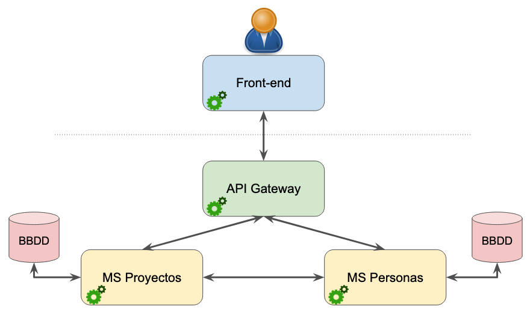

# Datos personales.

### Carlos Garvín Rubiales
- **Correo**: cgr00064@red.ujaen.es
- **Trello**: https://trello.com/b/OLkFbBiE/pr%C3%A1ctica-3-d%C3%A1gil
- **Para ver la implementación abrir en el navegador la URL**: http://localhost:8000
- **Código aplicación de ejemplo**: https://github.com/UJA-Desarrollo-Agil/descripcion-proyecto-microservicios-personas-proyectos
- **Video de la explicación**: https://youtu.be/Euh2YLOad6Q 

# *Plantilla Práctica Microservicios*: descripción de la aplicación.

Este código que se presenta aquí corresponde a la plantilla para realizar un desarrollo basado en microservicios para las prácticas de Desarrollo Ágil, para el curso 2022-2023.

## Arquitectura de la aplicación.

La aplicación funciona gracias a la colaboración de **tres aplicaciones distintas** (en realidad, tres servidores web implementados con [Express ↗️](https://expressjs.com/) para [Node.js ↗️](https://nodejs.org/en/)).

 

*Esquema de comunicación entre las distintas aplicaciones.* &#8593;

Como se puede observar, esta aplicación plantilla está formada por las siguientes aplicaciones web:
* Aplicación *front-end*: servidor para la página web
* Aplicación *api-gateway*: enrutador de peticiones a microservicios
* Aplicación *ms-plantilla*: microservicio

Se respetan siempre las siguientes reglas básicas:
1. El usuario solo interactúa con la aplicación *front-end*
2. La aplicación *front-end* solo interactúa con la aplicación *api-gateway*
3. La aplicación *api-gateway* recibe peticiones de *front-end* y las deriva al microservicio correspondiente. Dicho microservicio resuelve la petición y envía el resultado a la aplicación *front-end* a través de *api-gateway*
4. Los microservicios interactúan con una BBDD y con *api-gateway* y también entre ellos. 
5. En el caso de haber varios microservicios, cada uno de ellos puede interactuar con una BBDD distinta. Además, los microservicios pueden interactuar directamente entre ellos.

## Trello.

# Tablero al inicio.
Para la realización de la práctica se van a intentar realizar 2 incrementos, por lo que inicialmente se describen 6 HU, que se pueden ver en la siguiente imagen.

# Ejemplo descripción de como se han realizado las HU.

## Fauna.

Añadir al fichero README.md las capturas de pantalla de: tu home en Fauna, de la página en la que aparece la base de datos y de la página en la que aparece la colección. Copia y pega también todos los documentos que has creado en la colección en formato JSON.

## Primera Historia de Ususario.
Ir implementando cada una de las HU seleccionadas hasta que todas estén en la lista DONE. 

Muy importante: cuando se pase una tarjeta a la lista DONE debes añadirle al menos una captura de pantalla como evidencia de que efectivamente se ha quedado realizada la HU. Esta captura de pantalla puede ser de la interfaz de la aplicación (si es que es una funcionalidad que afecta a la interfaz), o de la interfaz de Fauna, o del IDE con el que se está programando (si es un trozo de código), etc. Es decir: una evidencia que muestre que dicha HU está realmente realizada.

HU implementadas, captura de pantalla de Trello al comienzo y al final del incremento, y capturas de pantalla del funcionamiento de la aplicación con las funcionalidades que se han implementado.