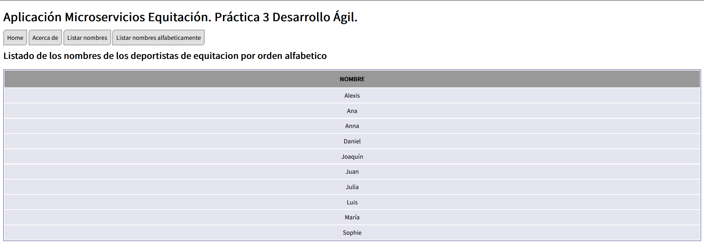

[](https://classroom.github.com/online_ide?assignment_repo_id=10404743&assignment_repo_type=AssignmentRepo)

# Datos personales.

### Carlos Garvín Rubiales
- **Correo**: cgr00064@red.ujaen.es
- **Trello**: https://trello.com/b/OLkFbBiE/pr%C3%A1ctica-3-d%C3%A1gil
- **Para ver la implementación abrir en el navegador la URL**: http://localhost:8000
- **Código aplicación de ejemplo**: https://github.com/UJA-Desarrollo-Agil/descripcion-proyecto-microservicios-personas-proyectos
- **Video de la explicación**: https://youtu.be/Euh2YLOad6Q 
- **Vídeo sobre cómo usar el depurador de código con JavaScript**: https://www.youtube.com/watch?v=qWM86MDluM4

# *Plantilla Práctica Microservicios*: descripción de la aplicación.

Este código que se presenta aquí corresponde a la plantilla para realizar un desarrollo basado en microservicios para las prácticas de Desarrollo Ágil, para el curso 2022-2023.


## Arquitectura de la aplicación.

La aplicación funciona gracias a la colaboración de **tres aplicaciones distintas** (en realidad, tres servidores web implementados con [Express ↗️](https://expressjs.com/) para [Node.js ↗️](https://nodejs.org/en/)).

 

*Esquema de comunicación entre las distintas aplicaciones.* &#8593;

Como se puede observar, esta aplicación plantilla está formada por las siguientes aplicaciones web:
* Aplicación *front-end*: servidor para la página web
* Aplicación *api-gateway*: enrutador de peticiones a microservicios
* Aplicación *ms-plantilla*: microservicio

Se respetan siempre las siguientes reglas básicas:
1. El usuario solo interactúa con la aplicación *front-end*
2. La aplicación *front-end* solo interactúa con la aplicación *api-gateway*
3. La aplicación *api-gateway* recibe peticiones de *front-end* y las deriva al microservicio correspondiente. Dicho microservicio resuelve la petición y envía el resultado a la aplicación *front-end* a través de *api-gateway*
4. Los microservicios interactúan con una BBDD y con *api-gateway* y también entre ellos. 
5. En el caso de haber varios microservicios, cada uno de ellos puede interactuar con una BBDD distinta. Además, los microservicios pueden interactuar directamente entre ellos.

## Trello.

### Tablero al inicio.
Primeras tres HU a implementar


### Ejemplo descripción de como se han realizado las HU.


## Fauna.

### Home de fauna


### Página donde aparece la base de datos


### Página donde aparece la colección


### Los campos a tener en cuenta para realizar la base de datos son:
- **Nombre** (cadena de texto)
_ **Apellido** (cadena de texto)
- **Fecha de nacimiento** (campo compuesto formado por día, mes y año)
- **Nacionalidad** (cadena de texto)
- **Edad** (número entero)
- **Disciplinas** (vector de disciplinas en las que participa el jinete)
- **Caballos** (vector de caballos que monta el jinete)
- **Años de participación en juegos olímpicos** (vector de años en los que el jinete ha participado en los juegos olímpicos)

### Documentos de la colección en formato JSON
```
{
"Nombre": "Juan",
"Apellido": "Pérez",
"Fecha de nacimiento": {"Día": 1, "Mes": 1, "Año": 1990},
"Nacionalidad": "Española",
"Edad": 33,
"Disciplinas": ["Salto", "Doma", "Concurso completo"],
"Caballos": ["Alazán", "Capricho", "Milagrosa"],
"Años de participación en juegos olímpicos": [2012, 2016]
}
```
```
{
"Nombre": "Julia",
"Apellido": "García",
"Fecha de nacimiento": {"Día": 15, "Mes": 7, "Año": 1985},
"Nacionalidad": "Española",
"Edad": 38,
"Disciplinas": ["Doma", "Vaquera"],
"Caballos": ["Negro", "Estrella"],
"Años de participación en juegos olímpicos": [2008, 2012, 2016]
}
```
```
{
"Nombre": "Ana",
"Apellido": "González",
"Fecha de nacimiento": {"Día": 30, "Mes": 4, "Año": 1995},
"Nacionalidad": "Argentina",
"Edad": 29,
"Disciplinas": ["Salto", "Doma"],
"Caballos": ["Rubio", "Canela", "Palomo"],
"Años de participación en juegos olímpicos": [2020]
}
```
```
{
"Nombre": "Daniel",
"Apellido": "Torres",
"Fecha de nacimiento": {"Día": 25, "Mes": 9, "Año": 1980},
"Nacionalidad": "Colombiana",
"Edad": 43,
"Disciplinas": ["Concurso completo", "Vaquera"],
"Caballos": ["Blanco", "Marrón"],
"Años de participación en juegos olímpicos": [2004, 2008, 2012, 2016]
}
```
```
{
"Nombre": "Sophie",
"Apellido": "Martin",
"Fecha de nacimiento": {"Día": 3, "Mes": 12, "Año": 1998},
"Nacionalidad": "Francesa",
"Edad": 25,
"Disciplinas": ["Doma", "Salto"],
"Caballos": ["Mistral", "Mocca"],
"Años de participación en juegos olímpicos": []
}
```
```
{
"Nombre": "Alexis",
"Apellido": "Johnson",
"Fecha de nacimiento": {"Día": 11, "Mes": 6, "Año": 1989},
"Nacionalidad": "Estadounidense",
"Edad": 34,
"Disciplinas": ["Salto", "Concurso completo"],
"Caballos": ["Rocinante", "Don Quijote", "Sancho Panza"],
"Años de participación en juegos olímpicos": [2012, 2016, 2020]
}
```
```
{
"Nombre": "María",
"Apellido": "Fernández",
"Fecha de nacimiento": {"Día": 20, "Mes": 2, "Año": 1992},
"Nacionalidad": "Española",
"Edad": 31,
"Disciplinas": ["Vaquera", "Doma"],
"Caballos": ["Fuego", "Relámpago", "Trueno"],
"Años de participación en juegos olímpicos": []
}
```
```
{
"Nombre": "Joaquín",
"Apellido": "Rodríguez",
"Fecha de nacimiento": {"Día": 18, "Mes": 10, "Año": 1993},
"Nacionalidad": "Mexicana",
"Edad": 28,
"Disciplinas": ["Doma", "Salto"],
"Caballos": ["Golondrina", "Azul", "Verde"],
"Años de participación en juegos olímpicos": [2016, 2020]
}
```
```
{
"Nombre": "Anna",
"Apellido": "Schmidt",
"Fecha de nacimiento": {"Día": 7, "Mes": 8, "Año": 1996},
"Nacionalidad": "Alemana",
"Edad": 27,
"Disciplinas": ["Salto", "Concurso completo"],
"Caballos": ["Lucky", "Star"],
"Años de participación en juegos olímpicos": [2016, 2020]
}
```
```
{
"Nombre": "Luis",
"Apellido": "García",
"Fecha de nacimiento": {"Día": 1, "Mes": 5, "Año": 1985},
"Nacionalidad": "Española",
"Edad": 38,
"Disciplinas": ["Vaquera", "Doma"],
"Caballos": ["Cruzcampo", "Alcázar"],
"Años de participación en juegos olímpicos": []
}
```

### Contraseña secreta

fnAE-3e0HaAAzK_zWElz_lNuFrDcFizlmo2oIetx

Que se ha añadido en el fichero **callbacks.ks** del directorio *ms-plantilla* de la siguiente manera:
```
const client = new faunadb.Client({
    secret: 'fnAE-3e0HaAAzK_zWElz_lNuFrDcFizlmo2oIetx',
});
```

# Historias de Ususario.
Ir implementando cada una de las HU seleccionadas hasta que todas estén en la lista DONE. 

Muy importante: cuando se pase una tarjeta a la lista DONE debes añadirle al menos una captura de pantalla como evidencia de que efectivamente se ha quedado realizada la HU. Esta captura de pantalla puede ser de la interfaz de la aplicación (si es que es una funcionalidad que afecta a la interfaz), o de la interfaz de Fauna, o del IDE con el que se está programando (si es un trozo de código), etc. Es decir: una evidencia que muestre que dicha HU está realmente realizada.

HU implementadas, captura de pantalla de Trello al comienzo y al final del incremento, y capturas de pantalla del funcionamiento de la aplicación con las funcionalidades que se han implementado.

## 01. Ver la información del autor/autora de la aplicación al pulsar en el botón “Acerca de” (Puntuación 0.1)
### Inicio tablero de Trello:


### Para la realización de esta HU se han seguido los siguientes pasos:
1. En el archivo **callbacks.js** del directorio *ms-plantilla* he añadido mis datos personales en los campos autor, email y fecha.
```
/**
* Devuelve un mensaje indicando que se ha accedido a la información Acerca De del microservicio
* @param {*} req Objeto con los parámetros que se han pasado en la llamada a esta URL 
* @param {*} res Objeto Response con las respuesta que se va a dar a la petición recibida
*/
acercaDe: async (req, res) => {
    try {
        CORS(res).status(200).json({
            mensaje: "Microservicio Equitacion: acerca de",
            autor: "Carlos Garvín Rubiales",
            email: "cgr00064@red.ujaen.es",
            fecha: "marzo, 2023"
        });
    } catch (error) {
        CORS(res).status(500).json({ error: error.description })
    }
},
```
### Test


```
it('Devuelve MS Plantilla Acerca De', (done) => {
    supertest(app)
        .get('/acercade')
        .expect(200)
        .expect('Content-Type', /json/)
        .expect(function (res) {
            //console.log( "BODY ACERCA DE ", res.body ); // Para comprobar qué contiene exactamente res.body
            assert(res.body.hasOwnProperty('mensaje'));
            assert(res.body.mensaje === "Microservicio Equitacion: acerca de");
        })
        .end((error) => { error ? done.fail(error) : done() })
});
```


### El resultado sería el siguiente:


### Fin tablero de Trello


## 02. Ver un listado solo con los nombres de todos los jugadores/equipos. (Puntuación 0.2)
### Inicio tablero de Trello:


### Para la realización de esta HU se han seguido los siguientes pasos:

1. En el directorio *ms-plantilla*, en el archivo **routes.js** se ha añadido lo siguiente:
```
/**
 * Devuelve todos los nombres de las personas que hay en la BBDD
 */
router.get("/getNombres", async (req, res) => {
    try {
        await callbacks.getNombres(req, res)
    } catch (error) {
        console.log(error);
    }
});
```

2. En el directorio *ms-plantilla*, en el archivo **callbacks.js** se ha añadido lo siguiente dentro de la funcion *CB_MODEL_SELECTS*:
```
/**
* Método para obtener solo los nombres de los deportistas de la BBDD.
* @param {*} req Objeto con los parámetros que se han pasado en la llamada a esta URL 
* @param {*} res Objeto Response con las respuesta que se va a dar a la petición recibida
*/
getNombres: async (req, res) => {
    try {
        let deportistas = await client.query(
            q.Map(
                q.Paginate(q.Documents(q.Collection(COLLECTION))),
                q.Lambda("X", q.Select(["data", "nombre"], q.Get(q.Var("X"))))
            )
        )
        CORS(res)
            .status(200)
            .json(deportistas)
    } catch (error) {
        CORS(res).status(500).json({ error: error.description })
    }
},
```

3. El siguiente paso ha sido añadir dentro del directorio *front-end* en el archivo **index.html** el boton correcpondiente para poder mostrar la información, se ha hecho de la siguiente manera dentro de la barra de navegación de la aplicacion *<nav>*:
```
<a href="javascript:Plantilla.listar_nombres()" class="opcion-principal"
    title="Realiza un listado con los nombres de los deportistas de equitación que hay en la BBDD">Listar nombres</a>
```

4. Por ultimo en el *front-end* tambien en el archivo **/static-files/js/ms-plantilla.js** se han implementado las funciones para poder listar toda la información:
```
/**
* Función principal para responder al evento de elegir la opción "Listar nombres"
*/
Plantilla.listar_nombres = function () {
    this.recupera_nombres(this.imprime_nombres);
}
```
```
/**
* Función que recupera todos los nombres de los deportistas de equitación llamando al MS Plantilla
* @param {función} callBackFn Función a la que se llamará una vez recibidos los datos.
*/
Plantilla.recupera_nombres = async function (callBackFn) {
    let response = null
     
    // Intento conectar con el microservicio personas
    try {
        const url = Frontend.API_GATEWAY + "/plantilla/getNombres"
        response = await fetch(url)
     
    } catch (error) {
        alert("Error: No se han podido acceder al API Gateway")
        console.error(error)
        //throw error
    }
    
    // Muestro todos los nombres que se han descargado
    let vectorNombres = null
    if (response) {
        vectorNombres = await response.json()
    callBackFn(vectorNombres.data)
    }
}
```
```
/**
* Función para mostrar en pantalla todos los deportistas de equitacion con su info que se han recuperado de la BBDD.
* @param {Vector_de_deportistas} vector Vector con los datos de los deportistas a mostrar
*/
Plantilla.imprime_nombres = function (vector) {
    //console.log( vector ) // Para comprobar lo que hay en vector
    let msj = "";
    msj += Plantilla.cabeceraTableNombres();
    vector.forEach(o => msj += Plantilla.cuerpoTrNombres(o))
    msj += Plantilla.pieTable();

    // Borro toda la info de Article y la sustituyo por la que me interesa
    Frontend.Article.actualizar( "Listado de los nombres de los deportistas de equitacion", msj )
}
```

### Test


Los test que se han realizado han sido los siguientes:

Se comprueba que los datos no son la cadena vacía.
```
it ('No hay campos vacíos en los datos al consultar el test mediante getNombres', (done) =>{
      supertest(app)
        .get('/getNombres')
        .expect(200)
        .expect('Content-Type', /json/)
        .expect(function (res) {
          const data = res.body.data;
          for (let i = 0; i < data.length; i++) {
            assert(data[i] !== "");
          }
        })
        .end((error) => { error ? done.fail(error) : done(); }
        );
    });
```

Se comprueba que el último nombre a mostrar sea Luis García.
```
it ('Devuelve Luis al consultar el test mediante getNombres', (done) =>{
      supertest(app)
        .get('/getNombres')
        .expect(200)
        .expect('Content-Type', /json/)
        .expect(function (res) {
          // console.log( res.body ); // Para comprobar qué contiene exactamente res.body
          assert(res.body.data[9] === "Luis");

        })
        .end((error) => { error ? done.fail(error) : done(); }
        );
    });
```
+ Resultado final:
```
> ms-plantilla@1.0.0 test
> jasmine

Randomized with seed 38712
Started
Microservicio PLANTILLA ejecutándose en puerto 8002!
.....


5 specs, 0 failures
Finished in 0.574 seconds
Randomized with seed 38712 (jasmine --random=true --seed=38712)
```


### El resultado sería el siguiente:


### Fin tablero de Trello:


## 03. Ver un listado con todos los datos de todos los jugadores/equipos ordenados alfabeticamente. (Puntuación 0.3)
### Inicio tablero de Trello:


### Para la realización de esta HU se han seguido los siguientes pasos:

1. En el directorio *ms-plantilla*, en el archivo **routes.js** se ha añadido lo siguiente:
```
/**
 * Devuelve todos los nombres de las personas que hay en la BBDD en orden alfabetico
 */
 router.get("/getAlfabeticamente", async (req, res) => {
    try {
        await callbacks.getAlfabeticamente(req, res)
    } catch (error) {
        console.log(error);
    }
});
```
2. En el directorio *ms-plantilla*, en el archivo **callbacks.js** se ha añadido lo siguiente dentro de la funcion *CB_MODEL_SELECTS*:
```
/**
* Método para obtener solo los nombres de los deportistas de la BBDD.
* @param {*} req Objeto con los parámetros que se han pasado en la llamada a esta URL 
* @param {*} res Objeto Response con las respuesta que se va a dar a la petición recibida
*/
getAlfabeticamente: async (req, res) => {
    try {
        let deportistas = await client.query(
            q.Map(
                q.Paginate(q.Documents(q.Collection(COLLECTION))),
                q.Lambda("X", q.Select(["data", "nombre"], q.Get(q.Var("X"))))
            )
        )
        deportistas.data=deportistas.data.sort() //Para ordenar alfabeticamente
        CORS(res)
            .status(200)
            .json(deportistas)
        } catch (error) {
            CORS(res).status(500).json({ error: error.description })
    }      
},
```

3. En el archivo **index.html** del directorio *front-end* el boton correcpondiente para poder mostrar toda la información, se ha hecho de la siguiente manera dentro de la barra de navegación de la aplicacion *<nav>*:
```
<a href="javascript:Plantilla.listar_alfabeticamente()" class="opcion-principal"
    title="Realiza un listado con los nombres de los deportistas de equitación que hay en la BBDD por orden alfabetico">Listar nombres alfabeticamente</a>
```

4. En el *front-end* tambien en el archivo **/static-files/js/ms-plantilla.js** se han implementado las funciones para poder listar toda la información:
```
/**
* Función principal para responder al evento de elegir la opción "Listar nombres"
*/
Plantilla.listar_alfabeticamente = function () {
    this.recupera_alfabeticamente(this.imprime_alfabeticamente);
}
```
Como se puede ver a continuacion se llama a la ruta */plantilla/getAlfab* creada en la HU anterior y se utiliza la funcion **sort()** para ordenar alfabeticamente.
```
/**
* Función que recupera todos los nombres de los deportistas de equitación llamando al MS Plantilla
* @param {función} callBackFn Función a la que se llamará una vez recibidos los datos.
*/
Plantilla.recupera_alfabeticamente = async function (callBackFn) {
    let response = null
     
    // Intento conectar con el microservicio personas
    try {
        const url = Frontend.API_GATEWAY + "/plantilla/getAlfabeticamente"
        response = await fetch(url)
     
    } catch (error) {
        alert("Error: No se han podido acceder al API Gateway")
        console.error(error)
        //throw error
    }
    
    // Muestro todos los nombres que se han descargado
    let vectorAlfabeticamente = null
    if (response) {
        vectorAlfabeticamente = await response.json()
    callBackFn(vectorAlfabeticamente.data)
    }
}
```
Aunque la siguiente funcion se podria reautilizar de la HU anterior he decidido crear una nueva para que muestre exclusivamente que estan ordenados por orden alfabetico.
```
/**
* Función para mostrar en pantalla todos los deportistas de equitacion con su info que se han recuperado de la BBDD.
* @param {Vector_de_deportistas} vector Vector con los datos de los deportistas a mostrar
*/
Plantilla.imprime_alfabeticamente = function (vector) {
    //console.log( vector1 ) // Para comprobar lo que hay en vector
    let msj = "";
    msj += Plantilla.cabeceraTableNombres();
    vector.forEach(o => msj += Plantilla.cuerpoTrNombres(o))
    msj += Plantilla.pieTable();

    // Borro toda la info de Article y la sustituyo por la que me interesa
    Frontend.Article.actualizar( "Listado de los nombres de los deportistas de equitacion por orden alfabetico", msj )
}
```

### Test

El test que se ha realizado ha sido el siguiente:

Que comprueba si realmente los nombres estan ordenados por orden alfabetico
```
it ('Los nombres están ordenados al obtenernlos mediante getAlfabeticamente', (done) =>{
      supertest(app)
        .get('/getAlfabeticamente')
        .expect(200)
        .expect('Content-Type', /json/)
        .expect(function (res) {
          const data = res.body.data;
          for (let i = 1; i < data.length; i++) {
            assert(data[i-1]<= data[i]);
          }
        })
        .end((error) => { error ? done.fail(error) : done(); }
        );
    });
```
+ Resultado final:
```
> ms-plantilla@1.0.0 test
> jasmine

Randomized with seed 25016
Started
Microservicio PLANTILLA ejecutándose en puerto 8002!
......


6 specs, 0 failures
Finished in 2.294 seconds
Randomized with seed 25016 (jasmine --random=true --seed=25016)
```


### El resultado sería el siguiente:


### Fin tablero de Trello:

